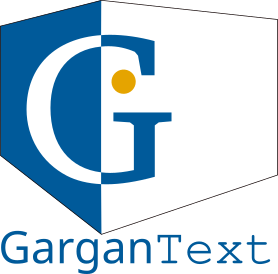

<div align="center"></div>

&nbsp;
# Gargantext with Purescript (FrontEnd instance)


&nbsp;&nbsp;&nbsp;&nbsp;&nbsp;&nbsp;&nbsp;&nbsp;&nbsp;&nbsp;&nbsp;&nbsp;&nbsp;&nbsp;&nbsp;&nbsp;&nbsp;&nbsp;&nbsp;&nbsp;


## About the project

GarganText is a collaborative web-decentralized-based macro-service
platform for the exploration of unstructured texts. It combines tools
from natural language processing, text-data-mining tricks, complex
networks analysis algorithms and interactive data visualization tools to
pave the way toward new kinds of interactions with your digital corpora.

This software is free software, developed and offered by the CNRS
Complex Systems Institute of Paris Île-de-France (ISC-PIF) and its
partners.

GarganText Project: this repo builds the
frontend for the backend server built by
[backend](https://gitlab.iscpif.fr/gargantext/haskell-gargantext).


## Getting set up

There are two approaches to working with the build:

1. Use Nix setup
2. Use Docker setup

### 1. Use Nix setup

First install [Nix](https://nixos.org/download.html): 

```shell
sh <(curl -L https://nixos.org/nix/install) --daemon
```

Verify the installation is complete (**Note:** close the current terminal session and open en new session to get nix working)
```shell
$ nix-env --version
nix-env (Nix) 2.11.0
```

To build the frontend just execute the install script at the root at the project:
```
./install
```
Just serve dist/index.html with any server and you are ready to be
connected to any backend. For instance you can serve it :

```
cd dist/ && python3 -mhttp.server
```

**Local instance is ready!** (Example: http://localhost:8000/)


### 2. Use Docker setup

You will need docker and docker-compose installed.

First, Source our environment file:

```shell
source ./env.sh
```

WARNING: you must `source ./env.sh` before using the docker
container. If you don't do that, the container will write files as
root and you'll need root powers to get ownership back!

Now build the docker image:

```shell
docker compose build frontend
```

That's it, skip ahead to "Development".

